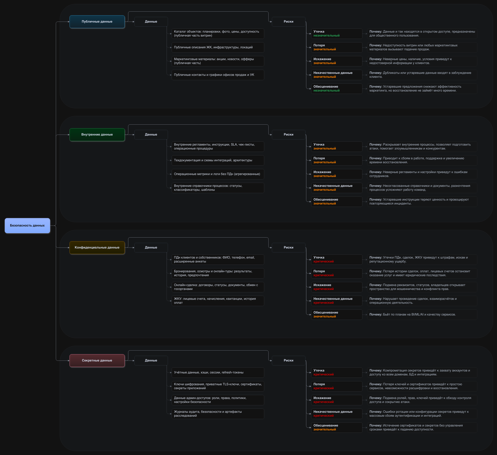
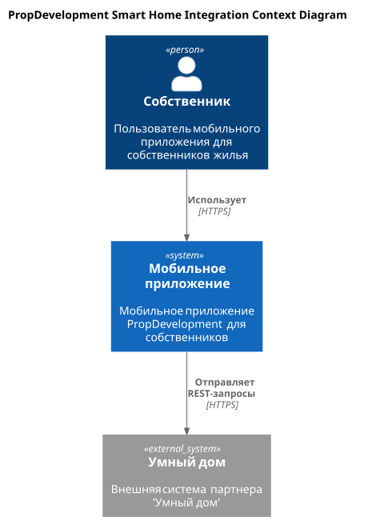
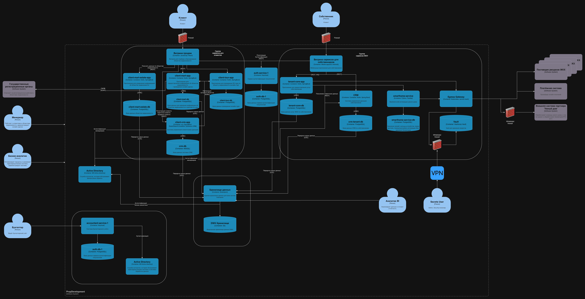
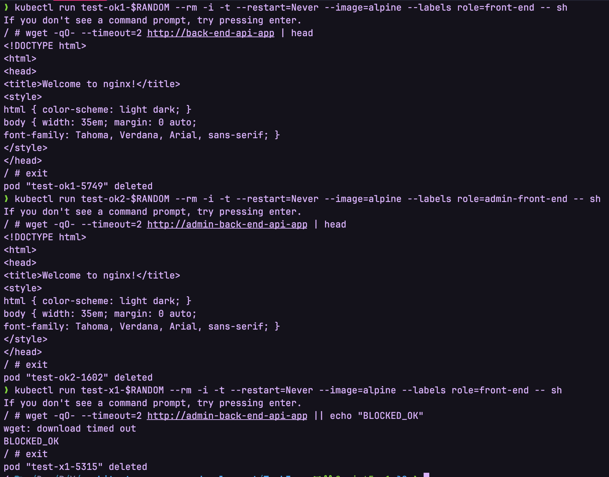

# Задание 1

- [Чеклист](Task1/README.md)
- [Mindmap исходник](Task1/mindmap.drawio)



# Задание 2

- [Чеклист](Task2/checklist.md)

# Задание 3

- [Диаграмма контекста C4](Task3/C4_Context.puml)



- [Доработанная диаграмма контейнеров C4](Task3/C4_Containers_With_Integration.drawio)



# Задание 4

## Как запустить

```bash
bash create-users.sh
bash create-roles.sh
bash bind.sh
```

# Задание 5

## Как запустить

```bash
bash run-services.sh
kubectl apply -f non-admin-api-allow.yaml
```

## Как проверить

```bash
kubectl run test-ok1-$RANDOM --rm -i -t --restart=Never --image=alpine --labels role=front-end -- sh
/ # wget -qO- --timeout=2 http://back-end-api-app | head
/ # exit

kubectl run test-ok2-$RANDOM --rm -i -t --restart=Never --image=alpine --labels role=admin-front-end -- sh
/ # wget -qO- --timeout=2 http://admin-back-end-api-app | head
/ # exit

kubectl run test-x1-$RANDOM --rm -i -t --restart=Never --image=alpine --labels role=front-end -- sh
/ # wget -qO- --timeout=2 http://admin-back-end-api-app || echo "BLOCKED_OK"
/ # exit
```

Результат проверок:


